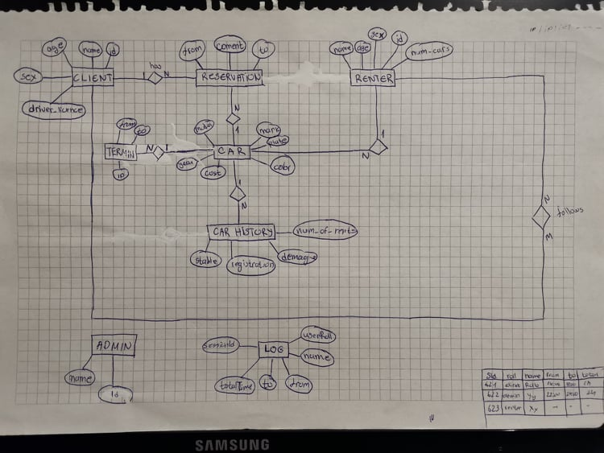

# CarRentManagementSystem
Spring project for renting cars

Име: Александар\
Презиме: Јованов\
Индекс: 163058

**Семинарска по предметот Веб Програмирање 2020год, Факултет за Информатички Науки и Компјутерско Инженерство.**

## Краток опис

Апликацијата преставува систем за рентање на автомобили и негов менаџмент.\
Во апликацијата постојат 3 улоги за најава:
* Админ
* Рентер
* Клиент

Секоја од овие улоги има разлчни можности, за целосно да се увиде функионалноста на апликацијата потребна е најава со секоја од улогите. Имплементирани се CRUD функционалности за сите ентитети и дополнителни карактеристики на апликацијата како креирање на нови слободни временски интервали при секоја нова резервација на автомобил, поставување на рејтинг за автомобил итн.

Во базата веќе има внесено од секоја улога по неколку претставници.
За најава со некој постоечка корисничка сметка искористете ги *Username* од табелата *User*, пасвордот на секој корисник е исто со неговото корисничко име освен првата буква која е мала (освен за некој корисници каде можеби сум направил грешка и е останата голема при полнењето на базата, пасвордите се енкриптирани и неможат да се видат).

Во базата тековно има еден Админ со:\
*username: admin*\
*password: admin*



## Стартување на проектот

Клонирајте го проектот од git, во него се наогаат и двете апликации односно и Frontend и Backend.
Отворете го целиот проект со IntelliJ IDEA и стартувајте го во debug mode, потоа навигирајте во "*/carrentfrontendbs*" и искористете ги командите\
```
npm install
npm start
```
Отворете го прелистувачот, и пристапете http://localhost:3000/home.

## Технологии користени во семинарската

* Spring Boot
* Spring Security with JWT tokens
* REST
* Jpa and Hinernate
* PostgreSQL (global data access with AWS Relational Database Service)
* Layered architecture
* React.js
* Reac-router-dom
* React Hooks
* Axios http client
* Material-UI
* MDB React

